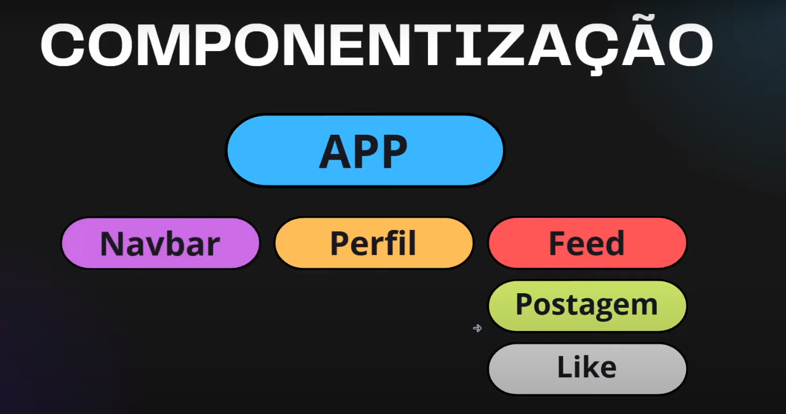

# Introdução ao React.js

React é uma biblioteca JavaScript de código aberto, desenvolvida pelo Facebook, utilizada principalmente para construir interfaces de usuário (UI) e aplicações web de forma reativa e eficiente. Ele permite que desenvolvedores criem componentes reutilizáveis que gerenciam seu próprio estado, facilitando a construção de interfaces complexas e interativas.

## Para que serve o React?

O React é usado para desenvolver interfaces de usuário dinâmicas, principalmente para aplicações de página única (Single Page Applications - SPAs). Ele ajuda a criar experiências de usuário rápidas e responsivas, gerenciando a manipulação do DOM de forma eficiente por meio de um conceito chamado "Virtual DOM".

## Vantagens do React

1. **Reutilização de Componentes**: Com o React, você pode criar componentes reutilizáveis que economizam tempo e facilitam a manutenção do código.
   
2. **Performance**: O React usa o Virtual DOM para atualizar apenas os elementos que mudaram, em vez de re-renderizar toda a página, o que melhora significativamente o desempenho.
   
3. **Comunidade Ativa e Ecosistema**: Como é uma biblioteca popular, há uma vasta quantidade de recursos, bibliotecas adicionais, documentação e suporte da comunidade.
   
4. **Fluxo de Dados Unidirecional**: O React utiliza um fluxo de dados unidirecional, facilitando o rastreamento de mudanças de estado, o que torna o comportamento do aplicativo mais previsível e fácil de depurar.
   
5. **SEO-Friendly**: Apesar de ser uma biblioteca focada no frontend, com técnicas adequadas, é possível renderizar páginas de forma que sejam amigáveis para mecanismos de busca.
   
6. **Compatibilidade com React Native**: Permite a criação de aplicativos móveis utilizando o mesmo conceito de componentes, o que facilita a transição entre desenvolvimento web e mobile.

# Aprendendo a criar um projeto com REACT + VIT, toda vez que criar um projeto será assim:

 O vite é um gerenciador de pacotes para JavaScript que torna o desenvolvimento de aplicações web mais rápido e fácil. Ele utiliza o Babel para transpilar, basicamente ele é um sistema de instalação mais rápida de tudo o que precisamos para o react e para instalar digite:
 
- npx é um executador de pacotes
```bash
npx create-vite .

//até o momento para versoes atuais o comando é:

npm create vite@latest curso-react -- --template react  

//depois para funcionar ele mostra as seguintes opções:
  cd curso-react
  npm install //instala todas as dependencias do vite para rodar o react
  npm run dev
```
# Depois o npm para instalar 
- isso porque o create-vite cria as os arquivos iniciais necessários para criar o projeto, mas ele nao instala os pacotes, ele vai pegar todas as dependencias do JSON e instalar no projeto

```bash
npm install
npm run dev
```
# Entendendo os arquivos que compoem o seu projeto:

- no arquivo node_modules, você pode ver as dependências do seu projeto, como o react, o react-dom, o react-router-dom, etc. Depois que ralizarmos a construção final, pois no react fazemos toda construção no ambiente de desenvolvimento depois que esta pronto ele gera uma build esse nosso App é compilado e é gerado os arquivos finais para produção;
- No arquivo public, você pode ver os assets que você deseja colocar no seu projeto, como imagens, fonts, etc. Depois que ralizarmos a construção;
- No arquivo src, você pode ver os seus componentes, as pastas components, as pastas pages, as pastas styles, etc. Depois que ralizarmos a construção, os seus componentes serão renderizados na tela;


- No arquivo.eslintrc.js, você pode ver as configurações do ESLint que você deseja utilizar, como as regras de lint, como o uso de hooks;


- No arquivo package.json, você pode ver as dependências do seu projeto, você pode ver também as scripts que você pode executar, como `npm run dev` para rodar o v;
- No arquivo vite.config.js, você pode ver as configurações do seu projeto, como o nome do seu projeto, o diretório de entrada, o diretório de;


- No arquivo index.html, `onde no body teremos uma div com id="root" dentro dessa div você vai colocar os seus componentes, o javascript que vai construir o seu app`
- no arquivo `main.jsx` temos o arquivo principal que está sendo chamado la no index.html do seu app,nesse arquivo `main.jsx` é onde você importa todos os seus componentes e chama o App; É aqui onde renderizamos todos os componentes na tela;

# React + Vite

This template provides a minimal setup to get React working in Vite with HMR and some ESLint rules.

Currently, two official plugins are available:

- [@vitejs/plugin-react](https://github.com/vitejs/vite-plugin-react/blob/main/packages/plugin-react/README.md) uses [Babel](https://babeljs.io/) for Fast Refresh
- [@vitejs/plugin-react-swc](https://github.com/vitejs/vite-plugin-react-swc) uses [SWC](https://swc.rs/) for Fast Refresh


## Fundamentos do React

1. **Componentes**: A base do React é a criação de componentes, que são pedaços isolados da interface que podem ter estado próprio e lógica de renderização. Os componentes podem ser de classe ou funcionais, sendo que os funcionais são mais comuns atualmente, especialmente com o uso de hooks.
  - exemplo: Imagine que você tenha uma aplicação "App" e dentro desse teu App você pode dividir em pedaços menores que chamamos de componentes como "Header", "Feed", "Footer", etc. e dentro desse Feed, você pode ter pedaços menores como um "Post", "botão de like", cada componente é criado de forma isolados e podem ser reutilizados em qualquer parte do seu projeto ou em outros componentes. Eles também tem sua própria memoria interna que são chamados de "estado", e cada componente pode ter também propriedades que podem fazer alterações únicas em cada um deles o que torna os componentes mais eficientes e mais resilientes. <br>

 <br>

 Componentes funcionais: Basicamente, são funções que retornam um HTML elemento JSX (JavaScript XML).

2. **JSX (JavaScript XML)**: JSX é uma sintaxe semelhante ao HTML que permite escrever código HTML dentro do JavaScript. Ele torna o código mais legível e expressivo, além de facilitar a criação de componentes.Também no jsx podemos fazer interpolação é injetar javascript dentro do HTML:

 ```jsx
function Titulo(){//componente 2 e colocamos no componente 1 App

    let nome = "ReactJS" //variável que pode ser alterada
    let urlImg = "https://encrypted-tbn0.gstatic.com/images?q=tbn:ANd9GcQjQFtEyXJg4vHdkl_XpdTlwMRzJOg_9g5uhQ&s" //variável que pode ser alterada
    //aqui o componente recebe a variável e exibe ela
    return (
        <div>
            <h1>Oi eu sou um título {nome}</h1>
            
        </div>
    )
    //poderia passar o valor assim do width = {200}
}

export default Titulo //sempre precisamos exportar o componente para ele poder funcionar e ser usado em outros arquivos
```
3. **Estado (State)**: O estado é um objeto que mantém informações dinâmicas de um componente. Alterações no estado provocam uma nova renderização do componente, refletindo mudanças na interface do usuário.Nada mais é do que a memória de um componente, é como se fosse uma variável que que vai armazenar um valor e sempre que existe uma alteração no valor dessa variável que chamamos de estado o react entende que o componente precisa ser re-renderiza-lo novamente. E isso faz com que o react tenha o nome de react "reagir" reage ao conteudo que ele tem dentro do estado, sua memoria interna, para criarmos um estado fazemos o seguinte:

```jsx
import { useState } from "react"; //informamos que queremos usar o "estado" do react

function Titulo({cor}){
   const [texto, setTexto] = useState("texto inicial"); //primeiro parametro é o valor inicial do estado, o segundo é a função que vai alterar esse estado
   // o estado é imutável, para alterar precisamos usar a função setTexto e ele diz respeito a memória de cada estado separado 
   // para ver o estado atual do componente podemos usar o método useState() sem nenhum argumento
   // exemplo: console.log(texto)
   // para alterar o estado precisamos usar a função setTexto(novoValor)
   // exemplo: setTexto("novo texto")
   // podemos ter como estado qualquer tipo de dado, não apenas string, mas também arrays e objetos, inteiro, boolean, etc.
    return (
        <div>
            <h1 style={{color:cor}}>{texto}</h1>
            <button onClick={()=>{setTexto("mudei via botao")}}>Mudar texto</button>
        </div>
    )
  
}

export default Titulo //sempre precisamos exportar o componente para ele poder funcionar e ser usado em outros arquivos
```
outro exemplo de estado:

```jsx

import { useState } from "react"; //informamos que queremos usar o "estado" do react

function Titulo({cor}){
   const [texto, setTexto] = useState("texto inicial"); //primeiro parametro é o valor inicial do estado, o segundo é a função que vai alterar esse estado
   // o estado é imutável, para alterar precisamos usar a função setTexto e ele diz respeito a memória de cada estado separado 
   // para ver o estado atual do componente podemos usar o método useState() sem nenhum argumento
   // exemplo: console.log(texto)
   // para alterar o estado precisamos usar a função setTexto(novoValor)
   // exemplo: setTexto("novo texto")
   // podemos ter como estado qualquer tipo de dado, não apenas string, mas também arrays e objetos, inteiro, boolean, etc.
   //vamos criar outro exemplo abaixo:
   
   const [inputText, setInputText] = useState("");//inputText vai ser o texto que estara dentro do campo input que esta no meio do codigo

   function clicou(){
    setTexto(inputText);
   }

   return (
        <div>
            <h1 style={{color:cor}}>{texto}</h1>
            <input value={inputText} onChange={(e)=>{setInputText(e.target.value)}} type="text" />
            <button onClick={clicou}>Mudar texto</button>
        </div>
    )
  
}

export default Titulo //sempre precisamos exportar o componente para ele poder funcionar e ser usado em outros arquivos
```

4. **Propriedades (Props)**: São parâmetros passados de um componente pai para um componente filho, permitindo a comunicação e a passagem de dados entre componentes. São atributos que passamos dentro dos nossos componentes depois chamamos eles dentro componentes como se fosse uma importação, e podemos manipular nosso componente de acordo com os props, ex:

 ```jsx
function Titulo({ nome, paragrafo, cor}){//componente 2 e colocamos no componente 1 App

   
    return (
        <div>
            <h1 style={{color:cor}}>Oi eu sou um título {nome ? nome:" fulano"}</h1>
            {paragrafo ?
                <p>Lorem ipsum dolor sit amet consectetur adipisicing elit. Ducimus, ab. Adipisci hic nihil voluptas tempore, aspernatur nobis quam, aut sequi veniam iste exercitationem, dolorem cum similique possimus alias vitae eius.</p>
                : 
                <p></p>
            }
        </div>
    )
    //poderia passar o valor assim do width = {200}
}

export default Titulo //sempre precisamos exportar o componente para ele poder funcionar e ser usado em outros arquivos
```
no arquivo App.jsx:
```jsx
import Titulo from "./Titulo" //podemos importar um componente dentro do outro componente e usa-lo como se fosse uma tag
//primeiro componente basico, sempre o nome do componente deve ter o mesmo nome do arquivo
function App() {
  
  // antes do componente estava isso: <div>Hello, World!</div> //retorna um div com o texto Hello, World!
  // return <Titulo/> 
  // para colocar mais de um componente dentro de outro, precisamos usar a tag <div> dentro de um parenteses e colocar os outros componentes dentro dela
  return (
    <div>
      <h1>Hello, World!</h1>
      <Titulo cor="green" nome="wues" paragrafo={true}/>
      
      <h1>Hello, World!</h1>
      <Titulo cor="blue"/>

      <h1>Hello, World!</h1>
      <Titulo cor="orange"/>
    </div>
  )
  // com isso podemos construir os coponentes de forma separada e dentro do conponente App fazermos a montagem das nossas paginas 
}

export default App //sempre precisamos exportar o componente para ele poder funcionar e ser usado em outros arquivos
```
5. **Hooks**: São funções que permitem aos desenvolvedores "ligar" o estado e outras funcionalidades do React em componentes funcionais. Os hooks mais comuns são `useState` (para gerenciar estados) e `useEffect` (para lidar com efeitos colaterais).

6. **Eventos**: Assim como no HTML, você pode manipular eventos (como cliques, alterações, etc.) diretamente nos elementos JSX.

7. **React Router**: Embora não faça parte do React em si, o React Router é frequentemente usado para gerenciar navegação entre páginas em aplicações React. o react foi feito para ser um framework de SPA (Single Page Application), ou seja tudo em uma única página. e `rotas` permitem que você navegue entre as páginas da sua aplicação, do jeito tradicional de navegação usavamos `links diretos no HTML` precisamos instalar uma biblioteca chamada `react-router-dom` ela que faz essa manipulação de rotas e permite que você navegue entre as páginas da sua aplicação. Para instalar o react-router-dom, você pode usar o npm ou yarn: vamos usar o npm:

   ```shell
   npm install react-router-dom
   ```
vamos ao exemplo: nesse trecho abaixo temos  cada componente

```jsx
import { Link } from 'react-router-dom';

function Menu() {
  return (
    <nav>
      <ul>
        <li><Link to="/">Home</Link></li>
        <li><Link to="/aboutus">About Us</Link></li>
        <li><Link to="/contact">Contact Us</Link></li>
      </ul>
    </nav>
  );
}

export default Menu;
//##############################################################
import Menu from './Menu';

function Home() {
  return (
    <div>
      <h1>Home</h1>
      <Menu /> {/* Aqui chamamos o componente Menu */}
    </div>
  );
}

export default Home;
//##############################################################
import Menu from './Menu';

function Contactus() {
  return (
    <div>
      <h1>Contact Us</h1>
      <Menu /> {/*aqui chamamos o componente Menu que tem os links(about us, contact, home) que está dentro do componente Home*/}
    </div>
  );
}

export default Contactus;
//##############################################################
import Menu from './Menu';

function Aboutus() {
  return (
    <div>
      <h1>About Us</h1>
      <Menu />
    </div>
  );
}

export default Aboutus;
//##############################################################

//###################### Aqui está como implementar as rotas
import { BrowserRouter, Routes, Route } from "react-router-dom";

import Home from "./components/Home"; // Importando o componente Home corretamente
import Aboutus from "./components/Aboutus"; // Importando o componente Aboutus
import Contactus from "./components/Contactus"; // Importando o componente Contactus


function App() {
  // 1) Colocamos o BrowserRouter
  // 2) Dentro do BrowserRouter colocamos o componente Routes e dentro dele fazemos uma rota Route
  // O primeiro path é da raiz, página inicial e o elemento que queremos que seja renderizado.
  return (
    <div>
      <BrowserRouter>
        <Routes>
          <Route path="/" element={<Home />} /> {/* Rota para Home */}
          <Route path="/aboutus" element={<Aboutus />} /> {/* Rota para About Us */}
          <Route path="/contact" element={<Contactus />} /> {/* Rota para Contact Us */}
        </Routes>
      </BrowserRouter>
    </div>
  );
}

export default App;

```

8. **Context API**: Uma forma de passar dados entre componentes sem precisar usar props manualmente a cada nível, ideal para gerenciamento de estados globais simples.

## Aprofundando o conhecimento nos fundamentos
# 1. Componentes no React?

**Componentes** são blocos de construção fundamentais no React, que permitem dividir a interface do usuário em partes reutilizáveis, independentes e gerenciáveis. Eles são como pequenas peças de um quebra-cabeça que, juntas, formam toda a aplicação.

## O Que São Componentes?

Componentes são como **pequenos módulos** de código que encapsulam lógica, estilo e estrutura (HTML) de uma parte específica da interface. Eles podem ser reutilizados em diferentes partes do aplicativo, facilitando a manutenção e o desenvolvimento.

### Analogia do Mundo Real:

Imagine que você está construindo uma casa. Em vez de construir tudo de uma vez, você cria partes menores, como quartos, banheiros, cozinha, etc. Cada parte tem sua própria funcionalidade e estilo, mas, juntas, formam a casa inteira. No React, cada componente é como um desses cômodos.

## Tipos de Componentes

Existem dois tipos principais de componentes no React:

1. **Componentes Funcionais**:
   - São componentes simples criados como funções JavaScript.
   - Usam **hooks** como `useState` e `useEffect` para gerenciar estado e efeitos colaterais.
   - **Exemplo da Vida Real**: É como um eletrodoméstico simples, como uma lâmpada, que só precisa de um interruptor (estado) para ligar e desligar.

2. **Componentes de Classe** (menos usados atualmente):
   - São componentes mais antigos criados como classes JavaScript.
   - Usam métodos de ciclo de vida para gerenciar ações do componente.
   - **Exemplo da Vida Real**: É como um aparelho mais complexo, como um computador, que tem vários modos e configurações (métodos de ciclo de vida).

## Vantagens dos Componentes

- **Reutilização**: Componentes podem ser reutilizados em várias partes da aplicação, economizando tempo e esforço.
  
- **Modularidade**: Dividir a aplicação em componentes menores facilita a manutenção e a leitura do código.

- **Isolamento**: Cada componente funciona de forma independente, o que evita que mudanças em um componente afetem outros.

- **Facilidade de Teste**: Testar componentes isoladamente é mais simples do que testar uma aplicação inteira.

## Estrutura Básica de um Componente Funcional

Aqui está um exemplo simples de um componente funcional no React:

```jsx
// Definindo um componente funcional chamado Botao
function Botao() {
  return (
    <button>Clique Aqui</button> 
  );
}

export default Botao;
```
# 2. JSX (JavaScript XML)?

**JSX** é uma extensão de sintaxe para JavaScript que permite escrever código HTML diretamente dentro de arquivos JavaScript. Ele é uma combinação de JavaScript e XML, que torna o código do React mais intuitivo e fácil de escrever, permitindo que você crie interfaces de usuário de forma declarativa.

## O Que É JSX?

JSX é uma forma de escrever elementos de interface de usuário (UI) dentro do código JavaScript, usando uma sintaxe que se parece muito com HTML. Isso torna o código mais legível e facilita a visualização da estrutura da UI dentro do JavaScript.

### Analogia do Mundo Real:

Imagine que você está criando um site e, em vez de separar o design (HTML) da lógica (JavaScript), você os combina em uma mesma linguagem para agilizar o processo. É como montar um sanduíche, onde todos os ingredientes (HTML e JavaScript) estão prontos para serem misturados, criando uma experiência rápida e intuitiva.

## Características do JSX

1. **Sintaxe Similar ao HTML**: JSX permite que você escreva código que se parece com HTML, mas com a flexibilidade do JavaScript.
   
2. **Incorpora JavaScript**: Dentro do JSX, você pode incorporar expressões JavaScript usando `{}`.

3. **Facilidade de Leitura e Escrita**: A sintaxe declarativa do JSX torna o código mais limpo e fácil de entender.

4. **Compilação**: JSX não é interpretado diretamente pelo navegador. Ele é transformado em código JavaScript puro (usando ferramentas como Babel) antes de ser executado.

## Exemplo Básico de JSX

```jsx
// Exemplo de um componente React usando JSX
function Saudacao() {
  const nome = "Maria";
  return (
    <h1>Olá, {nome}!</h1>
  );
}

export default Saudacao;
```
## Explicação do Exemplo:
**Sintaxe HTML Dentro do JavaScript**: A linha `<h1> Olá, {nome}!</h1>` parece HTML, mas está dentro de um código JavaScript. <br>
**Incorporação de Expressões JavaScript**: {nome} é uma expressão JavaScript que pode ser usada diretamente dentro do JSX para mostrar o valor da variável nome.


## Vantagens do JSX
**Código Mais Declarativo**: Fica claro como a UI deve se parecer, pois a estrutura é declarada diretamente no JavaScript.

**Facilidade de Integração**: Você pode facilmente integrar lógica de JavaScript (como variáveis e funções) com a estrutura visual do HTML.

**Detecção de Erros**: Erros de sintaxe em JSX são rapidamente identificados durante a compilação, facilitando a depuração.

**Melhor Fluxo de Trabalho**: JSX melhora o fluxo de trabalho dos desenvolvedores, permitindo uma codificação mais rápida e intuitiva.
<br>

# 3.Estado (State) no React?

**Estado (State)** é um dos conceitos centrais do React. Ele representa dados dinâmicos de um componente que podem mudar ao longo do tempo. O estado é o que torna um componente interativo e permite que ele responda a entradas do usuário, mudanças de dados, ou outras ações.

## O Que É Estado?

O **estado** é como uma memória interna de um componente que armazena informações que podem mudar enquanto o aplicativo está sendo usado. Ele é gerenciado e atualizado pelo próprio componente, e sempre que o estado muda, o componente é renderizado novamente para refletir as mudanças na interface do usuário.

### Analogia do Mundo Real:

Pense no estado como um **controle remoto de um ar-condicionado**. O controle remoto tem botões para ajustar a temperatura, a velocidade do ventilador, etc. O ar-condicionado responde a essas mudanças imediatamente. No React, o estado funciona como as configurações do controle remoto, mudando como o componente (ar-condicionado) se comporta.

## Características do Estado

1. **Local ao Componente**: Cada componente gerencia seu próprio estado. O estado é isolado e não afeta outros componentes diretamente.

2. **Dinâmico e Mutável**: O estado pode mudar em resposta a interações do usuário, ações assíncronas, ou outras mudanças no ambiente.

3. **Causa Re-renderização**: Quando o estado muda, o componente é automaticamente re-renderizado para refletir as novas informações na tela.

4. **Gerenciado por Hooks**: No React, o estado é frequentemente gerenciado com o hook `useState` em componentes funcionais.

## Exemplo Básico de Uso do Estado

```jsx
import React, { useState } from 'react';

function Contador() {
  // Definindo o estado inicial com o useState
  const [contador, setContador] = useState(0);

  // Função para incrementar o contador
  const incrementar = () => {
    setContador(contador + 1);
  };

  return (
    <div>
      <p>Valor do Contador: {contador}</p>
      <button onClick={incrementar}>Incrementar</button>
    </div>
  );
}

export default Contador;
``` 
## Explicação do Exemplo:
**Definindo o Estado**: useState(0) define o estado inicial do contador como 0.
**Atualizando o Estado**: setContador(contador + 1) é chamado ao clicar no botão, atualizando o valor do contador.
Renderização Automática: Quando o estado muda, o componente re-renderiza automaticamente para exibir o novo valor do contador.

## Vantagens do Estado
**Interatividade**: O estado permite que os componentes reajam a ações do usuário, como cliques, entradas de texto e muito mais.

**Gerenciamento Local de Dados**: Cada componente gerencia seu próprio estado, facilitando o controle de dados específicos.

**Fluxo Unidirecional de Dados**: No React, o estado flui de cima para baixo (pai para filho), o que ajuda a manter o fluxo de dados previsível e fácil de seguir.

**Re-renderização Automática**: As mudanças no estado disparam atualizações automáticas na interface, sem necessidade de manipular diretamente o DOM.

<br>

# 4.Propriedades (Props) no React?

**Propriedades (Props)** são uma forma de passar informações de um componente para outro no React. Elas permitem que os componentes se comuniquem entre si, enviando dados do componente pai para o componente filho, de forma semelhante a como se configuram parâmetros em uma função.

## O Que São Propriedades (Props)?

As **props** são como argumentos que você passa para um componente. Elas ajudam a configurar o comportamento do componente, personalizar seu conteúdo e fornecer os dados que ele precisa para funcionar corretamente. Diferente do estado, que é gerenciado dentro de um componente, as props são enviadas de fora, tornando os componentes mais dinâmicos e reutilizáveis.

### Analogia do Mundo Real:

Imagine que você está encomendando um sanduíche em um restaurante. Você pode personalizá-lo dizendo ao chef os ingredientes que quer: queijo, alface, tomate, etc. As **props** são como essas instruções — você está dizendo ao componente (o "chef") como ele deve "preparar" o que será mostrado na tela.

## Características das Props

1. **Imutáveis**: As props não podem ser alteradas pelo componente que as recebe; elas são apenas para leitura.

2. **Passagem de Dados**: As props permitem a passagem de dados de um componente pai para seus filhos, configurando como esses componentes filhos se comportam.

3. **Personalização de Componentes**: Com props, você pode criar componentes reutilizáveis que podem ser personalizados com diferentes valores de entrada.

4. **Fluxo Unidirecional de Dados**: As props fluem de cima para baixo na hierarquia de componentes, ajudando a manter a estrutura de dados clara e previsível.

## Exemplo Básico de Uso de Props

```jsx
// Componente pai que passa props para o componente filho
function App() {
  return <Saudacao nome="Maria" />;
}

// Componente filho que recebe props
function Saudacao(props) {
  return <h1>Olá, {props.nome}!</h1>;
}

export default App;
```

## Explicação do Exemplo:
**Envio de Props**: No componente App, a prop nome com o valor "Maria" é passada para o componente Saudacao.<br>
**Recebimento de Props**: No componente Saudacao, props.nome é usado para exibir o valor passado ("Maria") na tela.<br>
## Vantagens das Props
**Reutilização**: Props tornam os componentes mais reutilizáveis, pois você pode alterá-los apenas modificando as props que passam para eles.

**Flexibilidade**: Com props, um único componente pode ser usado em várias partes da aplicação com diferentes valores, comportamentos e aparências.

**Isolamento de Comportamento**: Componentes recebem dados e comportamentos específicos sem depender de variáveis externas ou do estado global.

**Facilidade de Debug**: A passagem clara de dados por meio de props facilita o rastreamento de onde os dados vêm e como são usados.

<br>

# 5. Hooks no React?

**Hooks** são uma funcionalidade do React que permitem que você use **estado** e outras funcionalidades do React em componentes funcionais, sem precisar converter esses componentes em classes. Introduzidos na versão 16.8 do React, os hooks simplificam o código, tornando-o mais limpo e fácil de entender.

## O Que São Hooks?

**Hooks** são basicamente funções especiais que permitem "enganchar" funcionalidades como estado, efeitos colaterais, e contexto a componentes funcionais do React. Antes dos hooks, essas funcionalidades estavam disponíveis principalmente em componentes de classe, que eram mais complexos de escrever e entender.

## Por Que Usar Hooks?

Imagine que hooks são como **ferramentas especiais** que ajudam você a realizar tarefas específicas em seus componentes, de forma mais organizada e reutilizável. Eles permitem:

1. **Adicionar Estado a Componentes Funcionais**: Com o hook `useState`, você pode adicionar e gerenciar estados locais em componentes funcionais.

2. **Executar Efeitos Colaterais**: Com o hook `useEffect`, você pode realizar ações como chamadas de API, assinaturas, ou qualquer coisa que precise acontecer após o componente ser renderizado.

3. **Compartilhar Lógica Entre Componentes**: Hooks customizados permitem encapsular e reutilizar lógica de forma fácil entre vários componentes.

## Principais Hooks do React

- **`useState`**: Adiciona estado local a um componente funcional.
  - **Exemplo da vida real**: É como ter uma memória interna em um dispositivo, onde você armazena valores que podem mudar conforme o uso.

- **`useEffect`**: Realiza efeitos colaterais como chamadas de API, manipulação de DOM, etc.
  - **Exemplo da vida real**: Imagine que você vai arrumar a casa sempre que recebe visitas (renderização). O `useEffect` seria o planejamento dessa arrumação, acontecendo após a chegada da visita.

- **`useContext`**: Acessa valores de contexto sem precisar passar props por vários níveis de componentes.
  - **Exemplo da vida real**: É como ter uma rádio interna em uma empresa que comunica informações diretamente a todos os funcionários, sem precisar de intermediários.

- **`useReducer`**: Gerencia estados mais complexos com uma abordagem similar ao Redux.
  - **Exemplo da vida real**: Pense em um controle remoto universal que você usa para gerenciar vários dispositivos de uma só vez.

- **`useMemo`**: Memoriza valores calculados para otimizar desempenho.
  - **Exemplo da vida real**: É como lembrar o caminho mais curto para o trabalho e usá-lo sempre, sem recalcular todos os dias.

- **`useCallback`**: Memoriza funções para evitar recriações desnecessárias.
  - **Exemplo da vida real**: É como ter uma lista de contatos prontos para ligar em vez de procurar o número toda vez.

## Vantagens dos Hooks

- **Código Mais Limpo e Organizado**: Menos código boilerplate e maior reutilização de lógica.
- **Componentes Funcionais Mais Poderosos**: Você pode fazer quase tudo que fazia com classes, agora em componentes funcionais.
- **Melhor Desempenho**: Hooks ajudam a evitar renderizações desnecessárias e otimizar o código.

---

Em resumo, hooks tornam o desenvolvimento com React mais simples, flexível e poderoso, facilitando a vida dos desenvolvedores ao criar aplicações interativas e eficientes.

# 6. Eventos no React?

**Eventos** no React são ações ou ocorrências que acontecem na interface da aplicação e que podem ser respondidas pelo código. Eles funcionam de forma semelhante aos eventos do DOM no JavaScript, como cliques de botão, entrada de texto, ou movimentos do mouse, mas com uma sintaxe adaptada para o React.

## O Que São Eventos?

Eventos são interações do usuário ou mudanças que ocorrem na aplicação, como um clique de mouse, um pressionamento de tecla ou o envio de um formulário. No React, você pode definir funções que respondem a esses eventos, permitindo que os componentes reajam de maneira dinâmica e interativa.

### Analogia do Mundo Real:

Pense em um interruptor de luz. Quando você aperta o botão, a luz acende ou apaga — essa é a "resposta" ao seu "evento" de apertar o botão. No React, você cria essas "respostas" (funções) para diversos "eventos" que podem acontecer na sua aplicação.

## Características dos Eventos no React

1. **Sintaxe JavaScript**: Eventos no React são definidos usando a sintaxe de camelCase (por exemplo, `onClick`), e as funções são passadas entre `{}`.

2. **Funções de Callback**: Para reagir a um evento, você define uma função de callback que será executada quando o evento ocorrer.

3. **Eventos Sintéticos**: O React usa um sistema de eventos sintéticos que é uma camada de abstração sobre os eventos do DOM, garantindo compatibilidade e desempenho.

4. **Eventos Comuns**: Alguns eventos comuns incluem `onClick` (clique do mouse), `onChange` (mudança em campos de formulário), `onSubmit` (envio de formulário), e `onMouseEnter` (mouse sobre um elemento).

## Exemplo Básico de Uso de Eventos

```jsx
import React, { useState } from 'react';

function BotaoClick() {
  const [mensagem, setMensagem] = useState('Clique no botão!');

  // Função que será executada no evento onClick
  const handleClick = () => {
    setMensagem('Botão clicado!');
  };

  return (
    <div>
      <p>{mensagem}</p>
      <button onClick={handleClick}>Clique aqui</button>
    </div>
  );
}

export default BotaoClick;
```
## Explicação do Exemplo:
**Definição do Evento**: O evento onClick é adicionado ao botão, e ao ser clicado, chama a função handleClick.<br><br>
**Função de Callback**: handleClick é a função que define o que acontece quando o botão é clicado — neste caso, altera a mensagem exibida.
Vantagens dos Eventos no React
**Interatividade**: Eventos permitem que os componentes reajam às interações do usuário, tornando a aplicação mais dinâmica e responsiva.

**Flexibilidade**: Você pode adicionar lógica personalizada para responder a eventos específicos, como validar um formulário antes do envio.

**Reutilização de Código**: Funções de eventos podem ser reutilizadas em diferentes partes da aplicação, facilitando a manutenção do código.

**Manejo de Estado**: Eventos são frequentemente usados em conjunto com o estado (state) para atualizar a interface em resposta a interações.

# 7. React Router?

**React Router** é uma biblioteca padrão para gerenciamento de rotas em aplicações React. Ele permite criar uma navegação dinâmica, possibilitando que os usuários se movam entre diferentes páginas ou seções da aplicação sem precisar recarregar toda a página.

## O Que É React Router?

React Router é uma ferramenta que gerencia a forma como as URLs da sua aplicação correspondem aos componentes que devem ser exibidos. Com ele, você pode definir rotas específicas que exibem diferentes componentes ou páginas, permitindo a criação de aplicações de página única (SPAs) com navegação fluida.

### Analogia do Mundo Real:

Imagine o React Router como um **GPS**. Quando você insere um destino (URL), o GPS guia você (exibe um componente) para o local correto sem que você precise sair do carro e reentrar toda vez que mudar de direção. Da mesma forma, o React Router permite que os usuários naveguem pela aplicação sem o carregamento completo da página, dando uma experiência mais fluida.

## Características do React Router

1. **Roteamento Dinâmico**: Permite definir rotas que podem mudar com base nas interações do usuário ou no contexto da aplicação.

2. **SPAs (Single Page Applications)**: Habilita navegação entre diferentes páginas sem recarregar a aplicação, mantendo o estado e a experiência do usuário.

3. **URLs Amigáveis**: Cria URLs que refletem o estado atual da aplicação, o que melhora a navegação e a indexação por motores de busca.

4. **Componentes Reutilizáveis**: Usando componentes como `<Route>`, `<Link>`, e `<Switch>`, você pode criar uma navegação flexível e escalável.

## Exemplo Básico de Uso do React Router

```jsx
import React from 'react';
import { BrowserRouter as Router, Route, Routes, Link } from 'react-router-dom';

// Componentes simulando diferentes páginas
function Home() {
  return <h2>Home</h2>;
}

function Sobre() {
  return <h2>Sobre</h2>;
}

function Contato() {
  return <h2>Contato</h2>;
}

function App() {
  return (
    <Router>
      <nav>
        <Link to="/">Home</Link> | <Link to="/sobre">Sobre</Link> | <Link to="/contato">Contato</Link>
      </nav>

      <Routes>
        <Route path="/" element={<Home />} />
        <Route path="/sobre" element={<Sobre />} />
        <Route path="/contato" element={<Contato />} />
      </Routes>
    </Router>
  );
}

export default App;
```

## Explicação do Exemplo:
**Definindo Rotas**: Com **`<Routes>`** e **`<Route>`**, você define quais componentes devem ser exibidos para cada URL.<br>
**Navegação**: O componente **`<Link>`** cria links que mudam a URL sem recarregar a página, navegando entre as rotas definidas.

## Vantagens do React Router
**Experiência de Usuário Melhorada**: A navegação é mais rápida e fluida, pois evita recarregamentos completos da página.

**URLs Consistentes**: As URLs refletem o conteúdo exibido, ajudando na navegação, histórico do navegador, e compartilhamento de links.

**Manutenção Facilitada**: Estruturar sua aplicação em rotas facilita a organização e a separação de responsabilidades.

**Controle Fino da Navegação**: Permite definir rotas protegidas, redirecionamentos, e comportamentos personalizados de navegação.

# 8. Context API?

**Context API** é uma funcionalidade do React que permite compartilhar dados entre componentes, sem a necessidade de passar props manualmente em cada nível da árvore de componentes. Isso simplifica a gestão de estados globais na aplicação, especialmente quando se trabalha com muitos componentes aninhados.

## O Que É Context API?

A Context API fornece uma forma de passar dados através da árvore de componentes sem precisar passar props manualmente em cada nível. Ela resolve o problema do "prop drilling", que é quando você precisa passar dados de um componente pai para um componente profundamente aninhado, passando pelos componentes intermediários que não precisam desses dados.

### Analogia do Mundo Real:

Imagine que você está em uma **família grande** com várias gerações vivendo juntas. Sempre que há uma informação importante, como o horário do jantar, ela é passada dos avós (componente pai) para os pais (componentes intermediários) e, finalmente, para as crianças (componentes filhos), mesmo que apenas as crianças precisem saber. Com a Context API, os avós podem comunicar diretamente com as crianças sem passar a informação através dos pais, simplificando a comunicação.

## Características do Context API

1. **Gerenciamento de Estado Global**: Permite armazenar estados ou dados que precisam ser acessíveis por múltiplos componentes em um único lugar.

2. **Evita Prop Drilling**: Elimina a necessidade de passar props manualmente por vários níveis de componentes intermediários.

3. **Escalabilidade**: Melhora a escalabilidade da aplicação ao reduzir o número de props que precisam ser gerenciadas.

4. **Contexto de Aplicação**: Context API é especialmente útil para temas, autenticação, configurações do usuário e outros estados globais.

## Exemplo Básico de Uso do Context API

```jsx
import React, { createContext, useContext, useState } from 'react';

// Criação do Contexto
const TemaContext = createContext();

// Componente que fornece o contexto
function TemaProvider({ children }) {
  const [tema, setTema] = useState('claro');

  const alternarTema = () => {
    setTema((prevTema) => (prevTema === 'claro' ? 'escuro' : 'claro'));
  };

  return (
    <TemaContext.Provider value={{ tema, alternarTema }}>
      {children}
    </TemaContext.Provider>
  );
}

// Componente que consome o contexto
function BotaoTema() {
  const { tema, alternarTema } = useContext(TemaContext);

  return (
    <button onClick={alternarTema}>
      Tema atual: {tema}
    </button>
  );
}

function App() {
  return (
    <TemaProvider>
      <BotaoTema />
    </TemaProvider>
  );
}

export default App;
```

## Explicação do Exemplo:

**Criação do Contexto**: `createContext()` cria um novo contexto que armazena o tema da aplicação.<br><br>
**Provedor de Contexto**: `TemaProvider` é o componente que fornece o contexto aos seus filhos, permitindo que todos os componentes dentro dele acessem o valor do contexto.<br><br>
**Consumidor do Contexto**: `useContext(TemaContext)` é usado no `BotaoTema` para acessar os valores e métodos do contexto.

## Vantagens do Context API
**Redução de Complexidade**: Simplifica a passagem de dados em aplicações grandes, reduzindo o código repetitivo.

**Melhor Organização**: Facilita o gerenciamento de estados e dados globais, mantendo o código mais limpo e modular.

**Flexibilidade**: Pode ser usado para gerenciar temas, autenticação, preferências do usuário, e muito mais.

**Manutenção Facilitada**: Com menos props sendo passadas manualmente, fica mais fácil entender como os dados fluem pela aplicação.
<br><br>

# Fundamentos do React.js

Este guia visa explicar os fundamentos do React.js de forma simples, utilizando analogias e exemplos práticos para facilitar o entendimento.

## 1. Componentes e Expressões JSX

### O que são Componentes?

Imagine que você está construindo uma casa de LEGO. Cada peça de LEGO representa um componente no React. Assim como as peças de LEGO podem ser combinadas para criar algo maior, os componentes React podem ser combinados para formar uma página inteira.

- **Componente**: Um bloco de construção independente da interface que pode ser reutilizado.
- **JSX (JavaScript XML)**: É uma maneira de escrever HTML dentro do JavaScript. Pense nele como uma receita: você escreve os ingredientes (código) e o React transforma em um prato (interface).

### Exemplo:

```jsx
function Botao() {
  return <button>Clique aqui</button>;
}
```
Acima, Botao é um componente que renderiza um botão na tela.

## 2. Hierarquia de Componentes e Props
O que é a Hierarquia de Componentes?
Pense na hierarquia de componentes como uma árvore genealógica. Componentes podem ser pais, filhos e netos. Os pais passam informações para os filhos, assim como em uma família.

### O que são Props?
Props (propriedades) são como cartas que você entrega para outra pessoa com instruções. Um componente pai passa dados para um componente filho através de props.

```jsx
function Saudacao(props) {
  return <h1>Olá, {props.nome}!</h1>;
}

function App() {
  return <Saudacao nome="Maria" />;
}
```
Nesse caso, Saudacao é o filho que recebe uma mensagem (props.nome) do pai App.

## 3. Hook useState
### O que é o useState?
Imagine um quadro branco onde você pode apagar e escrever coisas. O useState é como um quadro branco dentro do componente, onde você pode guardar informações que mudam com o tempo, como o número de cliques em um botão.

```jsx
import { useState } from 'react';

function Contador() {
  const [contagem, setContagem] = useState(0);

  return (
    <div>
      <p>Você clicou {contagem} vezes</p>
      <button onClick={() => setContagem(contagem + 1)}>Clique aqui</button>
    </div>
  );
}
```
Aqui, useState cria uma variável contagem e uma função setContagem para atualizar o valor.

## 4. Eventos
### O que são Eventos?
Eventos são como botões de elevador: quando você aperta um botão, algo acontece. No React, eventos são usados para capturar interações do usuário, como cliques e digitação.

```jsx
function Alerta() {
  function mostrarAlerta() {
    alert('Botão clicado!');
  }

  return <button onClick={mostrarAlerta}>Clique-me</button>;
}
```
Neste exemplo, ao clicar no botão, o evento onClick aciona a função mostrarAlerta.

## 5. Formulários e Renderização Condicional
### Formulários
Formulários são como questionários onde você preenche informações. Em React, você pode capturar os dados digitados pelo usuário e processá-los.

### Renderização Condicional
Renderização condicional é como escolher o que vestir com base no clima: se estiver frio, você veste um casaco; se estiver quente, coloca uma camiseta. No React, você pode renderizar diferentes partes da interface com base em condições.

```jsx
function Mensagem({ estaLogado }) {
  return estaLogado ? <h1>Bem-vindo!</h1> : <h1>Por favor, faça login.</h1>;
}
```
Se estaLogado for true, mostra "Bem-vindo!"; se for false, mostra "Por favor, faça login."

## 6. Expressões Ternárias e Listas
### Expressões Ternárias
São como atalho para decisões simples. Ao invés de if/else, você usa uma única linha para decidir.

```jsx
const cor = 'azul';
const mensagem = cor === 'azul' ? 'A cor é azul' : 'Não é azul';
```

### Listas
Listas são como uma fila de mercado. Você repete um processo para cada item da fila. No React, você usa .map() para criar elementos baseados em listas de dados.

```jsx
const frutas = ['Maçã', 'Banana', 'Laranja'];

function ListaDeFrutas() {
  return (
    <ul>
      {frutas.map((fruta, index) => (
        <li key={index}>{fruta}</li>
      ))}
    </ul>
  );
}
```
## 7. Formas de Estilizar Componentes
### Estilos Inline
Como colar um adesivo diretamente no objeto.

```jsx
const estilo = { color: 'red', fontSize: '20px' };
return <h1 style={estilo}>Texto Vermelho</h1>;
```
### CSS Módulos
Imagine ter um guarda-roupa com divisões para cada peça. CSS Módulos são como esses compartimentos, cada componente tem seu próprio estilo.

```css
/* Botao.module.css */
.botao {
  background-color: blue;
  color: white;
}
```

```css
import styles from './Botao.module.css';

function Botao() {
  return <button className={styles.botao}>Clique aqui</button>;
}
```

### Styled Components
É como ter um figurinista que faz roupas sob medida. Você cria componentes com estilos diretamente no código JavaScript.

```jsx
import styled from 'styled-components';

const BotaoEstilizado = styled.button`
  background-color: green;
  color: white;
`;

function App() {
  return <BotaoEstilizado>Styled Button</BotaoEstilizado>;
}
```
<br><br>

# Conceitos Avançados do React

Este documento explora conceitos avançados do React de forma simples, utilizando analogias do dia a dia para ajudar a entender melhor.

## 1. Hook `useEffect`

O `useEffect` é como um alarme que você programa para realizar uma tarefa em um momento específico. Ele é usado para lidar com efeitos colaterais em componentes, como buscar dados de um servidor, atualizar o título da página, ou subscrever a eventos.

**Exemplo da vida real**: Imagine que você define um alarme para regar as plantas todos os dias às 7h da manhã. Da mesma forma, `useEffect` define quando algo deve acontecer no seu componente.

```jsx
import { useEffect } from 'react';

function Alerta() {
  useEffect(() => {
    alert('Componente montado!');
  }, []); // Executa apenas uma vez quando o componente é montado

  return <h1>Veja o alerta ao carregar!</h1>;
}
```
## 2. Context API
A Context API é como um "alto-falante" para sua aplicação: você compartilha informações entre vários componentes sem precisar passar dados manualmente de pai para filho.

**Exemplo da vida real**: Imagine uma rádio que transmite informações para várias pessoas ao mesmo tempo. A rádio é o contexto e as pessoas que ouvem são os componentes que acessam essas informações.

```jsx
import { createContext, useContext } from 'react';

const TemaContexto = createContext('claro');

function ComponenteFilho() {
  const tema = useContext(TemaContexto);
  return <div>O tema atual é {tema}</div>;
}

function App() {
  return (
    <TemaContexto.Provider value="escuro">
      <ComponenteFilho />
    </TemaContexto.Provider>
  );
}
```
## 3. useReducer para Gerenciamento de Estado
useReducer é como uma central de controle de comandos, ideal para estados mais complexos. Ele permite que você defina regras de como o estado deve mudar.

**Exemplo da vida real**: Imagine uma lista de tarefas onde você pode adicionar, editar ou remover tarefas. useReducer gerencia essas ações como uma central de controle.

```jsx
import { useReducer } from 'react';

const initialState = { contagem: 0 };

function reducer(state, action) {
  switch (action.type) {
    case 'incrementar':
      return { contagem: state.contagem + 1 };
    default:
      return state;
  }
}

function Contador() {
  const [state, dispatch] = useReducer(reducer, initialState);

  return (
    <div>
      <p>Contagem: {state.contagem}</p>
      <button onClick={() => dispatch({ type: 'incrementar' })}>Incrementar</button>
    </div>
  );
}
```

## 4. Criando Custom Hooks
Custom hooks são como receitas personalizadas que você cria para repetir uma lógica específica em vários componentes.

**Exemplo da vida real**: Pense em um livro de receitas. Cada receita é uma instrução para preparar um prato. Custom hooks são suas próprias receitas, reutilizáveis em diferentes partes do seu aplicativo.

```jsx
import { useState, useEffect } from 'react';

function useContagem() {
  const [contagem, setContagem] = useState(0);

  useEffect(() => {
    const intervalo = setInterval(() => setContagem((c) => c + 1), 1000);
    return () => clearInterval(intervalo);
  }, []);

  return contagem;
}

function Contador() {
  const contagem = useContagem();
  return <h1>Contagem: {contagem}</h1>;
}
```
## 5. A Prop children
A prop children é como uma caixa onde você pode colocar qualquer coisa dentro. É usada para renderizar o conteúdo passado de um componente pai para um componente filho.

**Exemplo da vida real**: Pense em uma moldura de foto. A moldura é o componente e a foto que você coloca dentro é o children.

```jsx
function Moldura({ children }) {
  return <div className="moldura">{children}</div>;
}

function App() {
  return (
    <Moldura>
      <h1>Essa é a foto na moldura!</h1>
    </Moldura>
  );
}
```

## 6. Sincronização de Estado com Props
Sincronizar estado com props é como ajustar um relógio. As props enviam as horas, e o estado mantém o relógio sincronizado com a hora correta.

**Exemplo da vida real**: Pense em um professor escrevendo no quadro, e os alunos copiando o conteúdo. As props são as informações do professor, e o estado dos alunos é atualizado conforme o professor escreve.

```jsx
function Relogio({ horaInicial }) {
  const [hora, setHora] = useState(horaInicial);

  useEffect(() => {
    setHora(horaInicial);
  }, [horaInicial]);

  return <h1>Hora atual: {hora}</h1>;
}
```

## 7. useMemo e useCallback
useMemo e useCallback ajudam a evitar repetições desnecessárias de cálculos ou funções, como relembrar um endereço ao invés de recalculá-lo toda vez.

useMemo: Memoriza o resultado de um cálculo.
useCallback: Memoriza uma função para que não seja recriada sempre. <br>
**Exemplo da vida real**: Imagine um GPS que memoriza a última rota calculada para não recalcular o caminho sempre que você olha para o mapa.

```jsx
import { useMemo, useCallback, useState } from 'react';

function Calculadora() {
  const [numero, setNumero] = useState(0);

  const numeroDobrado = useMemo(() => {
    return numero * 2;
  }, [numero]);

  const aumentar = useCallback(() => {
    setNumero((n) => n + 1);
  }, []);

  return (
    <div>
      <p>Resultado Dobrado: {numeroDobrado}</p>
      <button onClick={aumentar}>Aumentar</button>
    </div>
  );
}
```
<br><br>

# React Router DOM e Navegação em Aplicações React

O React Router DOM é uma biblioteca que permite adicionar navegação a aplicações React, possibilitando criar rotas, links, e gerenciar o histórico de navegação da aplicação. Ele é essencial para criar aplicações de página única (SPAs) onde o usuário pode se mover de uma "página" para outra sem recarregar o site inteiro.

## 1. React Router DOM

O React Router DOM é como um GPS para a sua aplicação, ajudando a direcionar o usuário para diferentes "páginas" sem sair da aplicação. Ele permite criar rotas e definir o que deve ser exibido em cada rota, gerenciando a navegação de forma eficiente.

**Exemplo da vida real**: Imagine que você está em um shopping. Cada loja é uma rota diferente e o mapa do shopping (React Router DOM) te guia de uma loja para outra sem você precisar sair do shopping.

### Exemplo Básico de Uso:

```jsx
import { BrowserRouter as Router, Routes, Route } from 'react-router-dom';
import Home from './Home';
import Sobre from './Sobre';

function App() {
  return (
    <Router>
      <Routes>
        <Route path="/" element={<Home />} />
        <Route path="/sobre" element={<Sobre />} />
      </Routes>
    </Router>
  );
}

export default App;
```

## 2. Componentes NavLink e Hook useNavigate
### NavLink
O NavLink é como um guia de sinalização, ajudando os usuários a se orientarem e saberem onde estão na aplicação. Ele cria links de navegação e destaca o link atual, mostrando ao usuário em qual "página" ele está.

**Exemplo da vida real**: Pense em um shopping onde as lojas têm uma placa iluminada mostrando onde você está. Da mesma forma, NavLink destaca o caminho atual na navegação.

```jsx
import { NavLink } from 'react-router-dom';

function Navbar() {
  return (
    <nav>
      <NavLink to="/" activeClassName="ativo">
        Home
      </NavLink>
      <NavLink to="/sobre" activeClassName="ativo">
        Sobre
      </NavLink>
    </nav>
  );
}

export default Navbar;
```
### useNavigate
O useNavigate é como um motorista particular que te leva diretamente a uma rota quando você precisa. É um hook usado para programaticamente navegar para outras páginas dentro da aplicação.

**Exemplo da vida real**: Imagine que você quer ir para outra loja no shopping sem precisar andar até lá. Você aciona um carrinho de golfe (useNavigate) que te leva direto ao destino.

```jsx
import { useNavigate } from 'react-router-dom';

function PaginaInicial() {
  const navigate = useNavigate();

  const irParaSobre = () => {
    navigate('/sobre');
  };

  return (
    <div>
      <h1>Página Inicial</h1>
      <button onClick={irParaSobre}>Ir para Sobre</button>
    </div>
  );
}

export default PaginaInicial;
```

## 3. Rotas Dinâmicas e Página 404
Rotas Dinâmicas
Rotas dinâmicas permitem que você crie caminhos flexíveis na aplicação, como perfis de usuários ou detalhes de produtos, onde parte da URL é variável.

**Exemplo da vida real**: Pense em um supermercado onde você pode ir direto para qualquer seção digitando um código, como "Açougue" ou "Padaria". A rota é ajustada dinamicamente para te levar à seção correta.

```jsx
import { Route, Routes } from 'react-router-dom';

function App() {
  return (
    <Routes>
      <Route path="/produto/:id" element={<Produto />} />
    </Routes>
  );
}

function Produto() {
  const { id } = useParams();
  return <h1>Detalhes do Produto {id}</h1>;
}
```

## Página 404
A página 404 é como um segurança de shopping que te informa quando você está tentando acessar uma loja que não existe. Quando o usuário tenta ir para uma rota que não foi definida, ele é redirecionado para uma página de erro.

**Exemplo da vida real**: Se você tenta entrar em uma loja fechada, o segurança te avisa que você está no lugar errado. Da mesma forma, uma página 404 informa que a página não foi encontrada.

```jsx
import { Route, Routes } from 'react-router-dom';

function App() {
  return (
    <Routes>
      <Route path="/" element={<Home />} />
      <Route path="/sobre" element={<Sobre />} />
      <Route path="*" element={<Pagina404 />} /> {/* Página 404 */}
    </Routes>
  );
}

function Pagina404() {
  return <h1>404 - Página não encontrada</h1>;
}
```
<br><br>

# Integração do React com APIs: Fetch API e Axios

Este guia explica como o React pode se conectar a APIs externas usando `fetch API` e `Axios`. Você aprenderá a fazer requisições, adicionar, atualizar e excluir dados, e lidar com erros, tudo de forma simplificada e com exemplos do dia a dia.

## 1. React com API (Fetch API e Axios)

O React pode se comunicar com APIs para buscar dados, enviar informações ou modificar recursos. Existem duas maneiras populares de fazer isso: **Fetch API** e **Axios**.

- **Fetch API** é como enviar uma carta pelos correios. É o método nativo do JavaScript para fazer requisições de rede.
- **Axios** é como contratar um serviço de entrega rápido e confiável. Ele oferece mais funcionalidades e é mais fácil de usar que a Fetch API.

## 2. Requisição GET com Axios e Fetch API

Uma requisição GET é como pedir um catálogo de produtos de uma loja. Você não está comprando nada ainda, só está pedindo para ver o que eles têm.

### **Exemplo usando Fetch API:**

```jsx
import { useEffect, useState } from 'react';

function ListaDeProdutos() {
  const [produtos, setProdutos] = useState([]);

  useEffect(() => {
    fetch('https://api.exemplo.com/produtos') // Fazendo uma requisição GET
      .then((response) => response.json())
      .then((data) => setProdutos(data))
      .catch((error) => console.error('Erro ao buscar produtos:', error));
  }, []);

  return (
    <div>
      <h1>Lista de Produtos</h1>
      <ul>
        {produtos.map((produto) => (
          <li key={produto.id}>{produto.nome}</li>
        ))}
      </ul>
    </div>
  );
}
```

### **Exemplo usando Axios**
```jsx
import { useEffect, useState } from 'react';
import axios from 'axios';

function ListaDeProdutos() {
  const [produtos, setProdutos] = useState([]);

  useEffect(() => {
    axios.get('https://api.exemplo.com/produtos') // Fazendo uma requisição GET
      .then((response) => setProdutos(response.data))
      .catch((error) => console.error('Erro ao buscar produtos:', error));
  }, []);

  return (
    <div>
      <h1>Lista de Produtos</h1>
      <ul>
        {produtos.map((produto) => (
          <li key={produto.id}>{produto.nome}</li>
        ))}
      </ul>
    </div>
  );
}
```

## 3. Estruturando Componentes
Estruturar componentes é como montar um quebra-cabeça, onde cada peça tem um papel específico. No React, dividimos a interface em partes menores, como um cabeçalho, uma lista de produtos, e um rodapé.

**Exemplo da vida real**: Imagine uma casa onde você tem diferentes cômodos (componentes) como cozinha, sala e quarto, cada um com uma função específica.

```jsx
function Cabecalho() {
  return <header>Este é o cabeçalho</header>;
}

function Conteudo() {
  return <main>Este é o conteúdo principal</main>;
}

function Rodape() {
  return <footer>Este é o rodapé</footer>;
}

function App() {
  return (
    <div>
      <Cabecalho />
      <Conteudo />
      <Rodape />
    </div>
  );
}
```

## 4. Adicionando Post (POST)
Uma requisição POST é como enviar uma encomenda pelo correio; você está mandando algo para um servidor, como um novo produto ou um novo comentário.

**Exemplo da vida real**: Você escreve uma carta e a envia para o destinatário. O servidor recebe, lê a carta e adiciona a informação.

```jsx
import axios from 'axios';
import { useState } from 'react';

function AdicionarProduto() {
  const [nome, setNome] = useState('');

  const adicionarProduto = () => {
    axios.post('https://api.exemplo.com/produtos', { nome }) // Envia o novo produto
      .then((response) => console.log('Produto adicionado:', response.data))
      .catch((error) => console.error('Erro ao adicionar produto:', error));
  };

  return (
    <div>
      <input 
        type="text" 
        value={nome} 
        onChange={(e) => setNome(e.target.value)} 
        placeholder="Nome do produto"
      />
      <button onClick={adicionarProduto}>Adicionar Produto</button>
    </div>
  );
}
```
## 5. Atualizando e Excluindo Post (UPDATE/PUT e DELETE)
**UPDATE/PUT** é como editar uma carta que você já enviou. Você envia uma versão atualizada com as correções ou mudanças. <br>
**DELETE** é como cancelar uma entrega ou descartar uma carta. Você está pedindo para remover algo do servidor. <br>
**Exemplo da vida real**: Se você mandou uma encomenda errada, pode enviar uma atualização (UPDATE) ou pedir para o destinatário devolver (DELETE).

**Exemplo de Atualização**:
```jsx
function AtualizarProduto({ id, novoNome }) {
  const atualizarProduto = () => {
    axios.put(`https://api.exemplo.com/produtos/${id}`, { nome: novoNome }) // Atualiza o produto
      .then((response) => console.log('Produto atualizado:', response.data))
      .catch((error) => console.error('Erro ao atualizar produto:', error));
  };

  return <button onClick={atualizarProduto}>Atualizar Produto</button>;
}
```
**Exemplo de Exclusão:** 
```jsx
function ExcluirProduto({ id }) {
  const excluirProduto = () => {
    axios.delete(`https://api.exemplo.com/produtos/${id}`) // Exclui o produto
      .then(() => console.log('Produto excluído'))
      .catch((error) => console.error('Erro ao excluir produto:', error));
  };

  return <button onClick={excluirProduto}>Excluir Produto</button>;
}
```
## 6. Exibindo Erros de Requisição
Exibir erros de requisição é como receber uma mensagem do carteiro dizendo que houve um problema com a entrega. É importante informar o usuário quando algo dá errado.

**Exemplo da vida real**: Imagine que o correio avisa que não conseguiu entregar sua encomenda. No aplicativo, você mostra uma mensagem de erro para o usuário.

```jsx
function ErroDeRequisicao() {
  const [erro, setErro] = useState(null);

  const buscarDados = () => {
    axios.get('https://api.exemplo.com/dados')
      .then((response) => console.log(response.data))
      .catch((error) => setErro('Falha ao buscar dados. Tente novamente.'));
  };

  return (
    <div>
      <button onClick={buscarDados}>Buscar Dados</button>
      {erro && <p style={{ color: 'red' }}>{erro}</p>}
    </div>
  );
}
```
## 7. Custom Hook com Requisição para API
Criar um Custom Hook com requisição para API é como criar um atalho para realizar uma tarefa repetitiva, como um botão de "compra rápida" que já preenche tudo para você.

**Exemplo da vida real**: Imagine que você tem uma caneta com carimbo para assinar todos os documentos de uma vez. Um custom hook encapsula a lógica de comunicação com a API, tornando tudo mais simples.

```jsx
import { useState, useEffect } from 'react';
import axios from 'axios';

function useFetch(url) {
  const [dados, setDados] = useState([]);
  const [erro, setErro] = useState(null);

  useEffect(() => {
    axios.get(url)
      .then((response) => setDados(response.data))
      .catch((error) => setErro(error.message));
  }, [url]);

  return { dados, erro };
}

function ListaProdutos() {
  const { dados: produtos, erro } = useFetch('https://api.exemplo.com/produtos');

  if (erro) {
    return <p>Erro ao carregar produtos: {erro}</p>;
  }

  return (
    <ul>
      {produtos.map((produto) => (
        <li key={produto.id}>{produto.nome}</li>
      ))}
    </ul>
  );
}
```